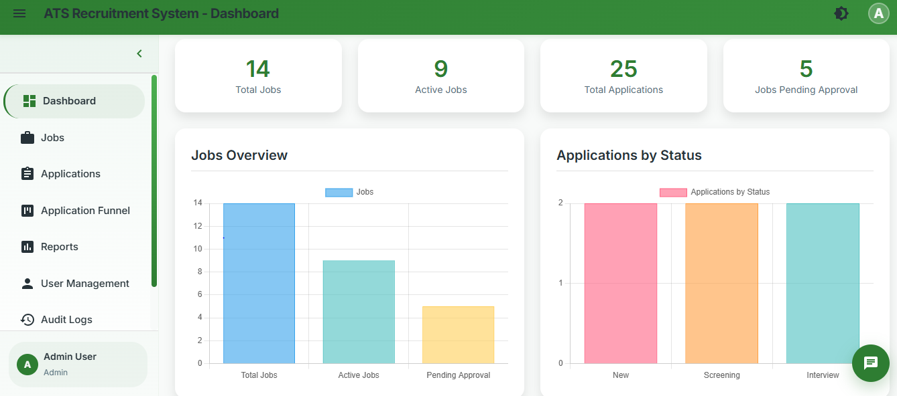
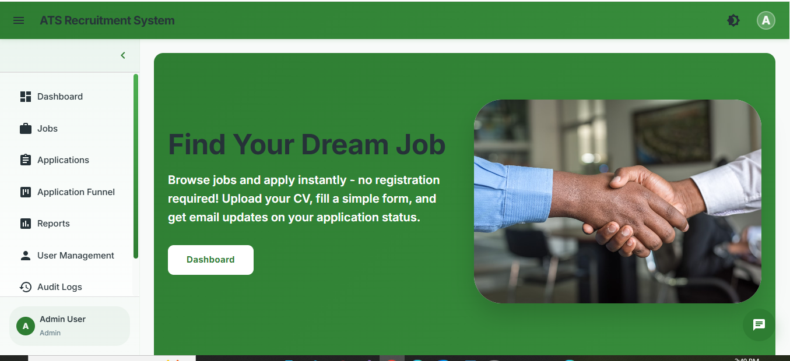
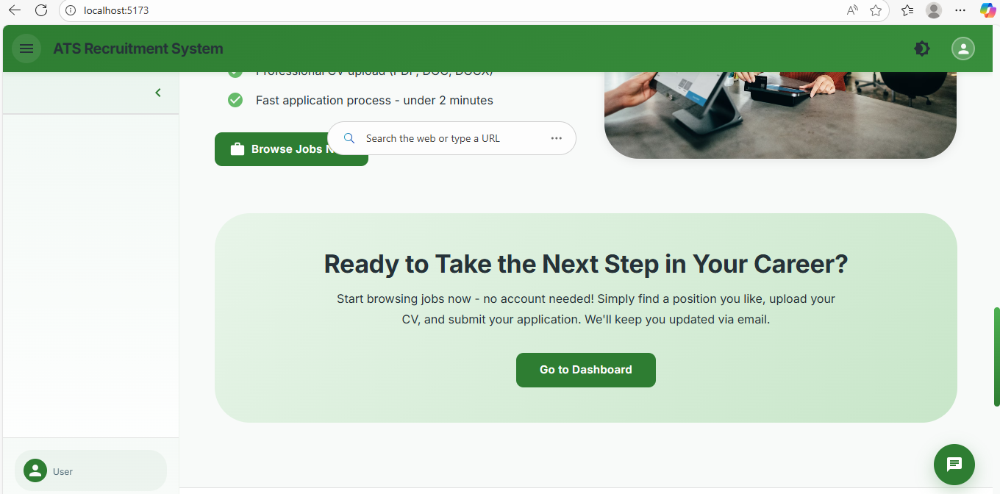
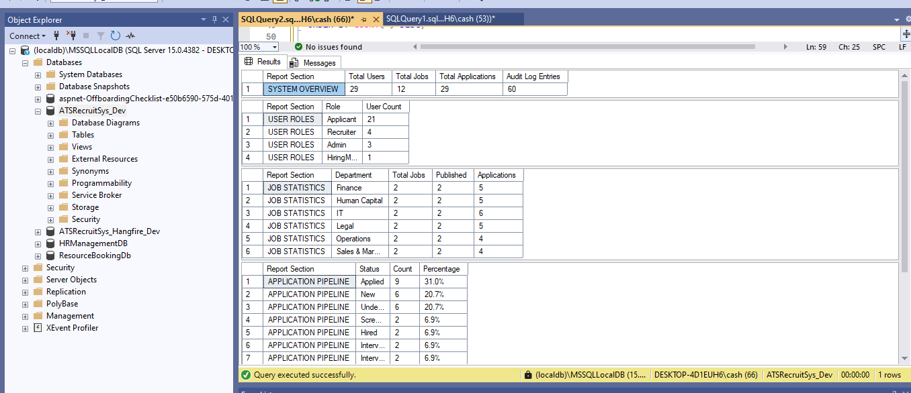
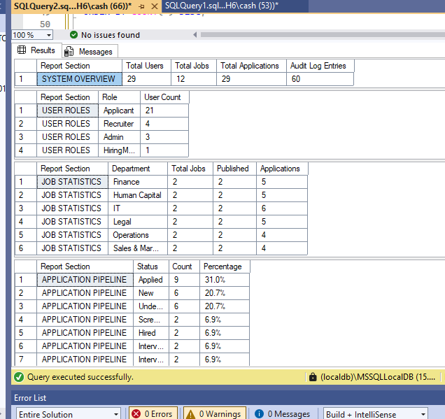
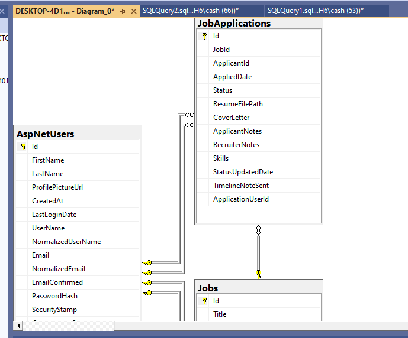
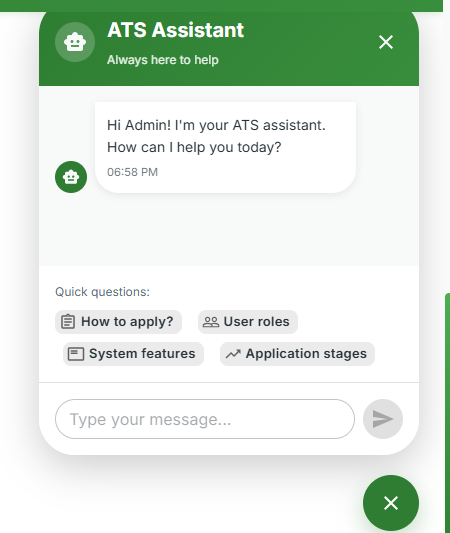

# Screenshots Folder

This folder stores documentation screenshots for the ATS Recruitment System.

## Application Overview

### Dashboard & Homepage

*Main dashboard showing system statistics and overview*

*Public homepage for the recruitment system*

### Authentication

*User login interface*

*Login form details*

*Landing page before authentication*

## Job Management

### Job Listings & Details

*Job management interface for administrators*

*Detailed view of job postings*

### Job Creation

*Job creation interface*

*Additional job creation options*

*Final job creation step*

## Application Process

### Job Applications

*Job application form*

*Application submission process*

### Application Management

*Administrator view of all applications*

*Additional application management features*

### Application Funnel

*Visual representation of application stages*

*Status tracking and updates*

## User Management

*User management dashboard*

*User creation interface*

*New user registration process*

## Profile & Settings

*User profile update interface*

*Additional profile settings*

## Reports & Analytics

### Report Overview

*Main reports dashboard*

*Distribution analysis reports*

### Department Analytics

*Department-specific analytics*

*Extended department reporting*

## System Features

### Audit Logs

*System audit trail*

*Detailed audit information*

### Database Management

*Database overview*

*Database management interface*

*Database configuration*

### Additional Features

*AI chatbot integration*

*Mobile/collapsed navigation view*

## Themes

*Light theme interface*

*Dark theme interface*

---

**Note:** Keep screenshot names simple and ASCII-only. Remove emojis to avoid rendering issues.